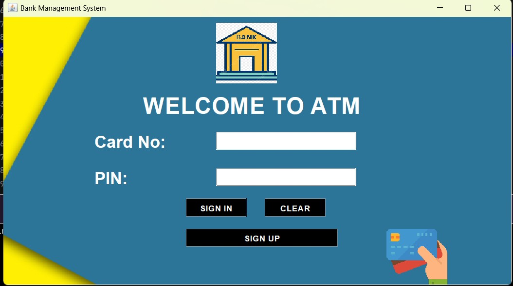
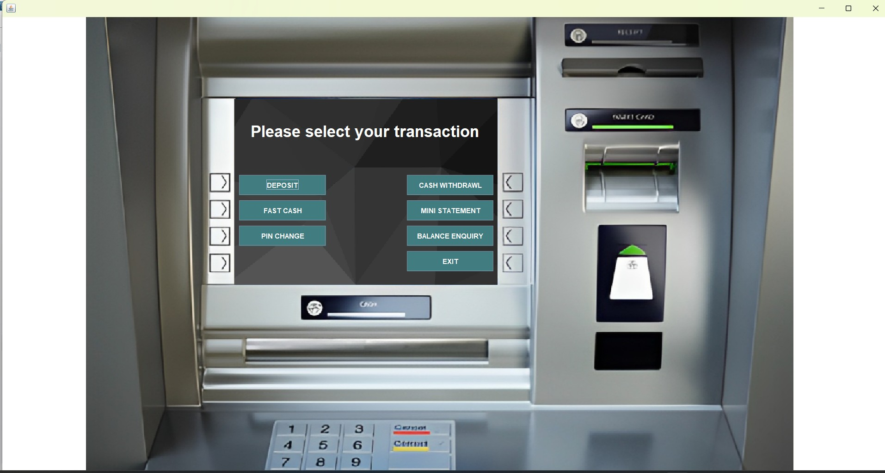
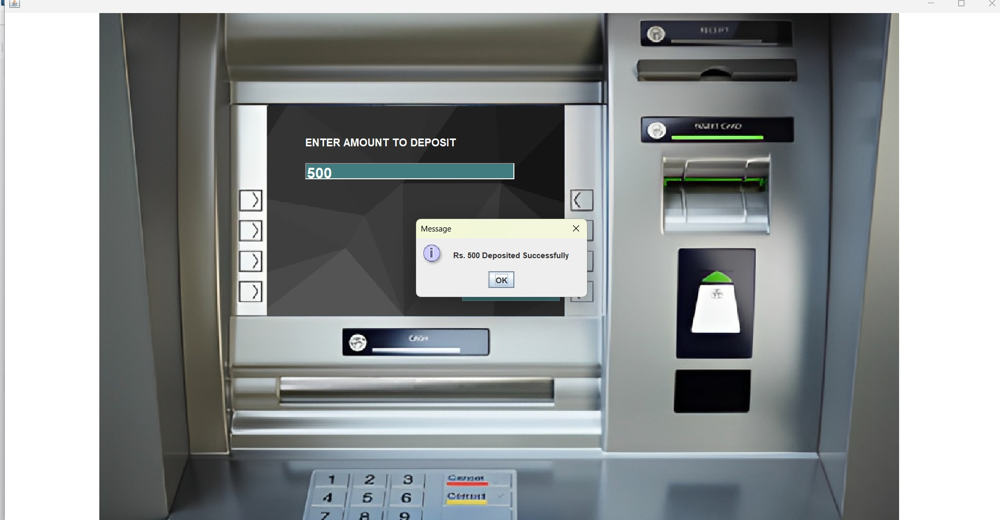

# 🏦 Bank Management System

A desktop-based **Bank Management System** developed using **Java, Java Swing, JDBC, and MySQL** to simulate core banking operations such as account creation, deposits, withdrawals, balance inquiry, mini statements, and transaction management.

This project demonstrates concepts of:

- Object-Oriented Programming (OOP)
- Database Connectivity using JDBC
- GUI Development using Java Swing
- SQL-based Transaction Management
- Event-Driven Programming

---

# ✨ Features

✔️ User Registration & Login  
✔️ Secure PIN Verification  
✔️ Deposit Money  
✔️ Withdraw Money  
✔️ Fast Cash Functionality  
✔️ Balance Enquiry  
✔️ Mini Statement Generation  
✔️ PIN Change Option  
✔️ MySQL Database Integration  
✔️ Interactive GUI using Java Swing  

---

# 🛠️ Tech Stack

| Technology | Used For |
|---|---|
| Java | Core Application Logic |
| Java Swing | GUI Development |
| JDBC | Database Connectivity |
| MySQL | Database Management |
| IntelliJ IDEA / Eclipse | Development Environment |

---

# 📂 Project Structure

```bash
Bank-Management-System/
│── src/
│   ├── Login.java
│   ├── Signup.java
│   ├── Deposit.java
│   ├── Withdrawl.java
│   ├── FastCash.java
│   ├── BalanceEnquiry.java
│   ├── MiniStatement.java
│   └── Conn.java
│
│── icons/
│── README.md
```

---

# ⚙️ Installation & Setup

## 1️⃣ Clone the Repository

```bash
git clone https://github.com/AnitaSahoo2002/Bank-Management-System.git
```

---

## 2️⃣ Open the Project

Open the project in:

- IntelliJ IDEA
- Eclipse
- NetBeans

---

## 3️⃣ Configure MySQL Database

Create a MySQL database:

```sql
CREATE DATABASE bankmanagementsystem;
```

Update your database credentials in:

```java
Conn.java
```

Example:

```java
String url = "jdbc:mysql://localhost:3306/bankmanagementsystem";
String username = "root";
String password = "your_password";
```

---

## 4️⃣ Run the Project

Run:

```bash
Login.java
```

---

# 📸 Application Modules

## 🔐 Authentication Module
- User Login
- Signup
- PIN Verification

## 💰 Transaction Module
- Deposit
- Withdraw
- Fast Cash
- Balance Enquiry

## 📄 Banking Services
- Mini Statement
- PIN Change
- Transaction History

---

# 📸 Application Screenshots

## 🔐 Login Page



---

## 🏦 Dashboard



---

## 💸 Deposit Page



# 🧠 Concepts Used

- Java Swing Components
- JFrame & Event Handling
- JDBC Connectivity
- SQL Queries
- Exception Handling
- OOP Principles

---

# 🚀 Future Improvements

- Add OTP Verification
- Implement Email/SMS Alerts
- Add Admin Dashboard
- Improve UI/UX Design
- Online Banking Integration
- Password Encryption & Hashing

---

# 🤝 Contributing

Contributions are welcome.

If you'd like to improve this project:

1. Fork the repository
2. Create a new branch
3. Commit your changes
4. Open a Pull Request

---

# 📜 License

This project is developed for educational and learning purposes.

---

# 👩‍💻 Author

**Anita Sahoo**  
Electronics & Instrumentation Engineering Student  
Passionate about Software Development and Data Analytics

GitHub: [AnitaSahoo2002](https://github.com/AnitaSahoo2002)


